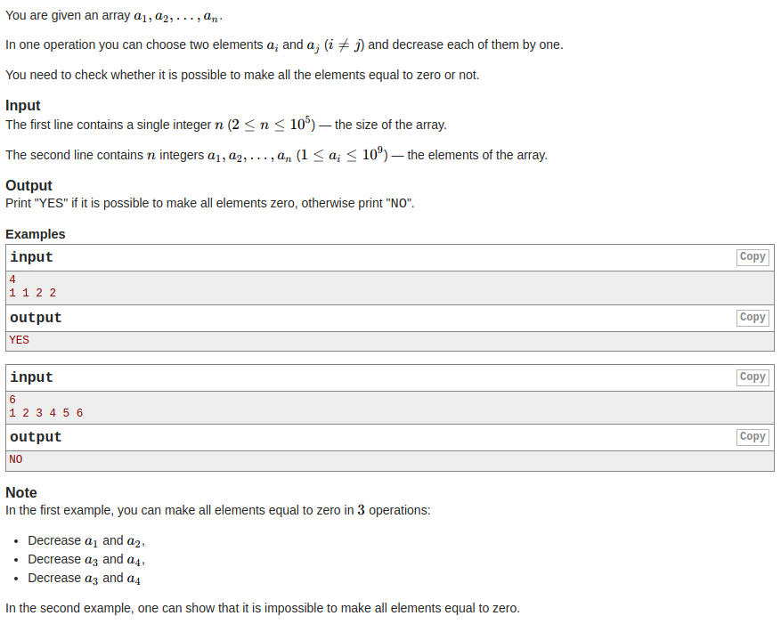

# Zero Array

[](https://travis-ci.com/boivlad/zero-array)

## How to test:
1. Clone this repository
2. `npm intsall`
3. `npm test`
## How to use:
1. Clone this repository
2. `npm intsall`
3. Example:
```javascript
const { zeroArray } = require('../src/index');
zeroArray(4, [1, 2, 3, 4]); //Result "YES"
zeroArray(6, [1, 2, 3, 4, 5, 6]); //Result "NO"
```
Print `YES` if it is possible to make all elements zero, otherwise print `NO`.

